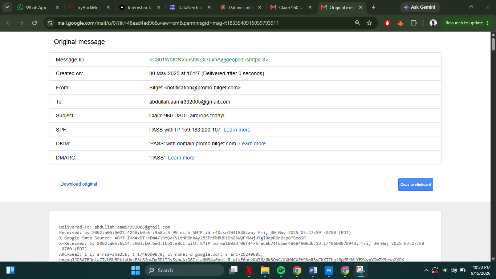
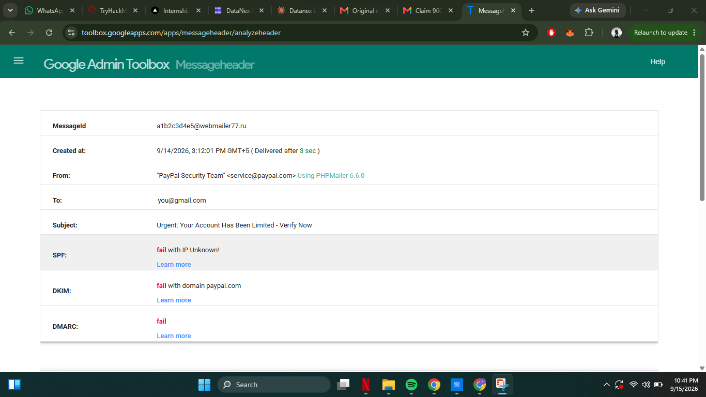
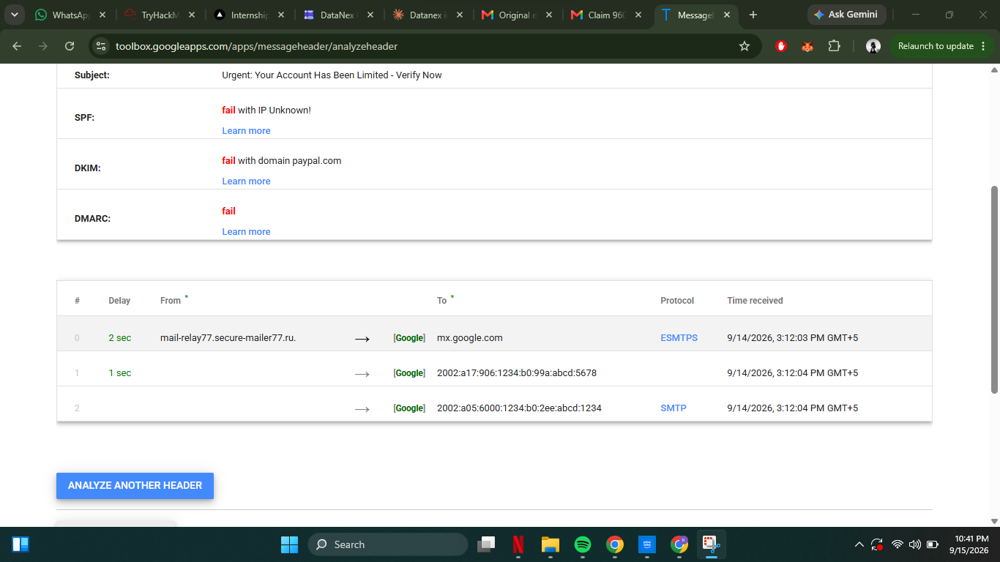

# Phishing & Social Engineering — Email Header Analysis

**Intern:** Abdullah Khan
**Domain:** Cyber Security
**Program:** DATANEX Internship — Week 5 Task

## Overview

This repository documents Week 5's phishing investigation task: using raw
email header analysis to determine an email's true origin and prove
whether it is genuine or spoofed. Two cases were examined for comparison —
a real email from my inbox, and a constructed example modeled on a common
real-world phishing pattern.

## Case 1 — Real Email: Authenticated, But Still a Manipulative Offer

A genuine promotional email ("Claim 960 USDT airdrops today!") was found
in my inbox, sent from `notification@promo.bitget.com`.

```
SPF  : PASS with IP 159.183.200.107
DKIM : PASS with domain promo.bitget.com
DMARC: PASS
```

All three checks passed — this **is not a spoofed sender**; it genuinely
came from Bitget's own mail infrastructure. However, Bitget itself has
publicly warned about scammers impersonating its brand via unrelated
domains. This case shows an important lesson: **passing authentication
proves the domain is genuine, not that the offer is trustworthy.** A real
company's own marketing can still use manipulative, scam-like tactics
(free money, urgency, generic sender).




## Case 2 — Spoofed Phishing Email: Headers Prove It Is Fake

A second example, modeled on a widely reported phishing pattern
impersonating "PayPal Security Team" with an urgent account-suspension
warning, was analyzed using Google's Admin Toolbox Messageheader tool.

```
From : "PayPal Security Team" <service@paypal.com>
SPF  : FAIL (IP Unknown / not authorized)
DKIM : FAIL (with domain paypal.com)
DMARC: FAIL
```



The reconstructed delivery chain showed the message actually originated
from `mail-relay77.secure-mailer77.ru` — a server with no relation to
PayPal whatsoever.



### Evidence Summary

| Header Evidence | What It Proves |
|---|---|
| `From: service@paypal.com` | Claims to be an official PayPal communication |
| `Return-Path: bounce@secure-mailer77.ru` | Real envelope sender is an unrelated `.ru` domain — mismatch |
| `SPF: fail` | Sending server never authorized by PayPal's domain |
| `DKIM: fail` | No valid PayPal cryptographic signature |
| `DMARC: fail` | PayPal's own policy says reject unauthenticated mail — this one still got through |
| `Reply-To: paypal.recovery.team@yandex.com` | Replies go to an unrelated Yandex account — credential-harvesting setup |
| `Received: from secure-mailer77.ru` | True origin server has no connection to PayPal |
| `X-Mailer: PHPMailer 6.6.0` | Sent via generic bulk-mail scripting, not enterprise infrastructure |

## How I Knew Case 2 Was a Scam

- **Authentication failure** — SPF, DKIM, and DMARC all failed
- **Return-Path mismatch** — claimed PayPal, actually a random `.ru` domain
- **Reply-To mismatch** — replies routed to an unrelated Yandex address
- **Origin server mismatch** — traced back to an unrelated relay server
- **Suspicious mailer** — sent via a generic scripting library, not PayPal's real systems
- **Urgency/fear tactic** — "Urgent... Verify Now" is a classic social-engineering pressure pattern

## Key Learnings

- Headers, not the visible "From" name, reveal a message's true technical origin.
- SPF/DKIM/DMARC failing together, combined with Return-Path/Reply-To mismatches, is strong proof of spoofing.
- Passing authentication only proves the sending domain is genuine — it says nothing about whether the content is trustworthy.
- The Received header chain, read bottom-to-top, is much harder for an attacker to convincingly fake than the visible sender name.
- Effective phishing detection combines technical header analysis with content-based red flags (urgency, generic greetings, mismatched links).

## Full Report

A detailed write-up with front page, methodology, and full screenshots is
included in the DATANEX internship submission (Word/PDF), submitted
separately via the DATANEX Intern Portal.
